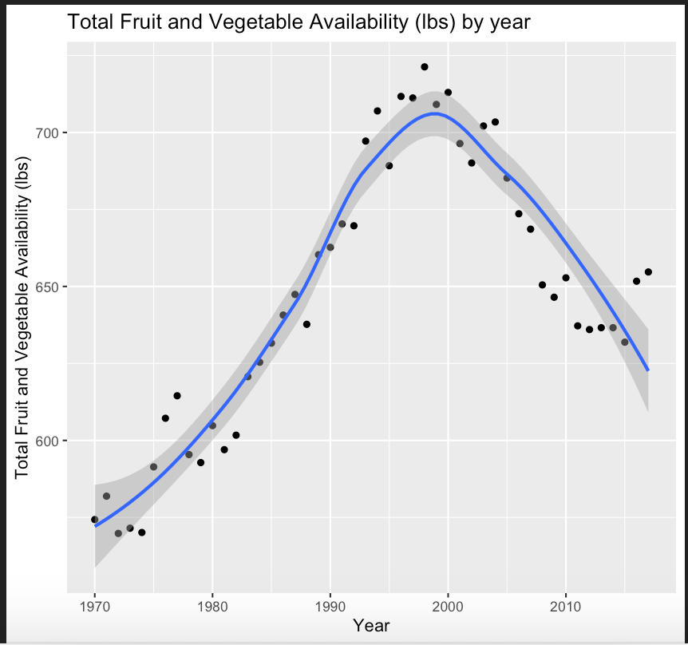
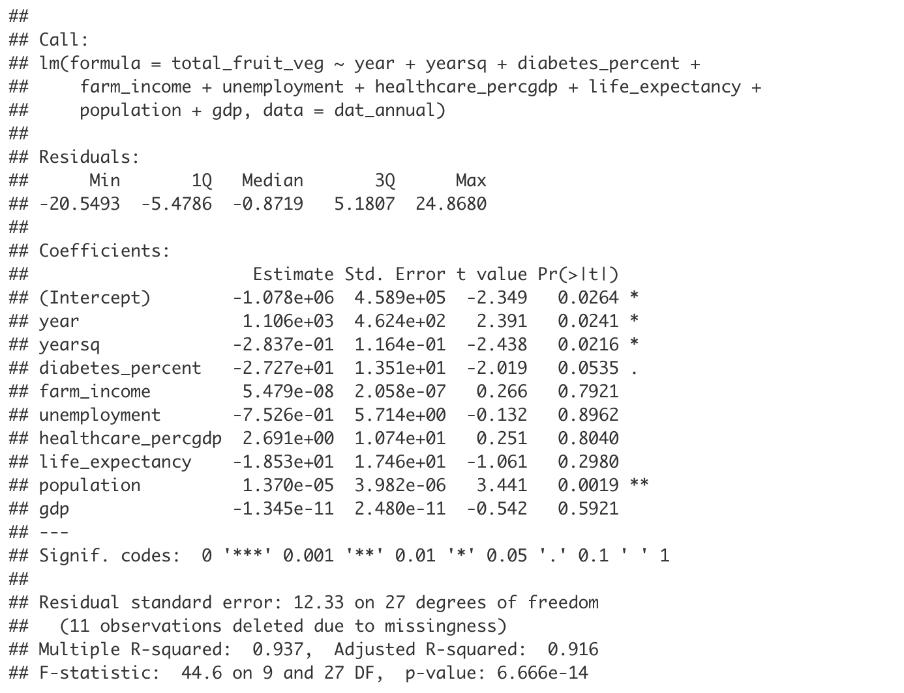

# Fruit and Vegetable Availability

## Introduction

Food security is a major public health concern. In order for people to live their healthiest lives, they must be able to access fresh produce. During my undergraduate studies, I worked part-time as a gardener and at a farmer’s market for two years, so food systems are of personal interest to me. During my time working these jobs, I learned about the way in which outside factors can largely influence an individual’s ability to access foods which are considered healthy. My hope is to observe what factors can predict the availability of various fruits and vegetables. Through this investigation, we may gain an understanding of what external forces are associated with the stability of our food systems and the health-related decisions that individuals are able to make.

One of the main priorities for this project is to create an interactive way to observe the trends of food availability over time, and how these metrics are associated with external factors. Such factors include real gross domestic product, diabetes prevalence, and unemployment rate. The ideal way to explore these trends would be through a Shiny app. In one tab, I will provide an interactive way to observe trends over time for a vegetable or fruit of choice, and in a second tab, I will provide an opportunity for the user to observe how availability correlates with other factors through scatterplots. Additionally, I hope to implement regression analyses to create a predictive system for food availability and consumption. 

### Data Sources

Data on per capita annual availability for fruits and vegetables is available through the US Department of Agriculture. Total availability, as well as values for fresh fruit, processed fruit, fresh vegetables, and processed vegetables were downlaoded and availability amounts from 1970 to 2016 were combined into one dataframe. Potential predictors included in the analysis were diabetes prevalence (available from the Centers for Disease Control and Prevention), average annual farm income (available from the US Department of Agriculture), annual unemployment rate (available from the US Bureau of Labor Statistics), percent GDP spending on healthcare (available from the Centers for Medicare and Medicaid Services) , average life expectancy, population, and GDP (available from the Gapminder foundation). Note that farm income is in terms of 2019 dollars (i.e. adjusted for inflation).

### Regression Analysis

To begin, I wanted to observe how the total availability varies over time. 

From the plot, we can see that the trend is not linear. Thus, in fitting a regression model, we may want to include a transformed version of the year variable, such as a quadratic term. In controlling for a set of potential covariates, we obtain the following model output:

We find that the model explains roughly 92% of the variability in total per capita fruit and vegetable availbility, as denoted by the adjusted R-squared value. This is quite impressive! However, many of the predictors were correlated with each other. In selecting the most appropriate model, we must keep in mind that many of the predictors are correlated with each other and the outcome variable does not follow a normal distribution. We must also remember that the sample size is quite small, so it will be important to investigate how these trends may or may not hold for larger datasets, such as ones which include data from other countries. The high adjusted R-squared in the full model may simply be a case of overfitting.

### Interactive Visualization App

The embedded Shiny app allows us to observe the availability trends over time for specific products. Additionally, we may observe how any two variables from our dataset correlate with each other and vary over time.

<iframe src="https://nwbirk.shinyapps.io/bst260-final-project/" width="100%" height="950px"></iframe>

### Conclusions

Through this study, I was able to fit a linear model to predict total annual fruit and vegetable per capita availability with an adjusted R-squared of 0.916. However, it is important to note that we only have availability data for 47 years and many of the assumptions of linear regression were not satisfied. This sample is quite small, especially for the number of covariates we included in our model. We may also want to consider the complicated temporality of these assocations. For example, is it the case that farm income can be used as a predictor of availability, or should availability be used to predict farm income? Further research may focus on how the model performs on data from other countries, if available, or can be tested on data from later years once this information becomes available.

The interactive data visualization app helps us to uncover some interesting trends. While total fruit and vegetable consumption follows a roughly quadratic trend over the years, individual fruits and vegetables seem to follow very unique trends of their own. The avocado, for example, seems to have exponentially  increased in availability over the last couple of decades, while peaches and pears have steadily been decreasing over time. Using this tool, we can develop further questions about the market and environmental forces that may be causing these trends. In regards to the pairwise correlations tool, the most surprising discovery is the weakness of the relationship between annual farm income and food availability. One possible explanation for this matter is the amount of variability between farms. Perhaps the growth in average farm income over time is driven by farmers who focus on certain crop types. This could especially influence the trend based on the weight of their crop since availability is measured in pounds. In all, this interactive tool can be used to investigate trends in the data and inform future investigations into agricultural and consumption trends.

### Video Summary

<iframe width="560" height="315" src="https://www.youtube.com/embed/UU24bedoPdY" frameborder="0" allow="accelerometer; autoplay; encrypted-media; gyroscope; picture-in-picture" allowfullscreen></iframe>

